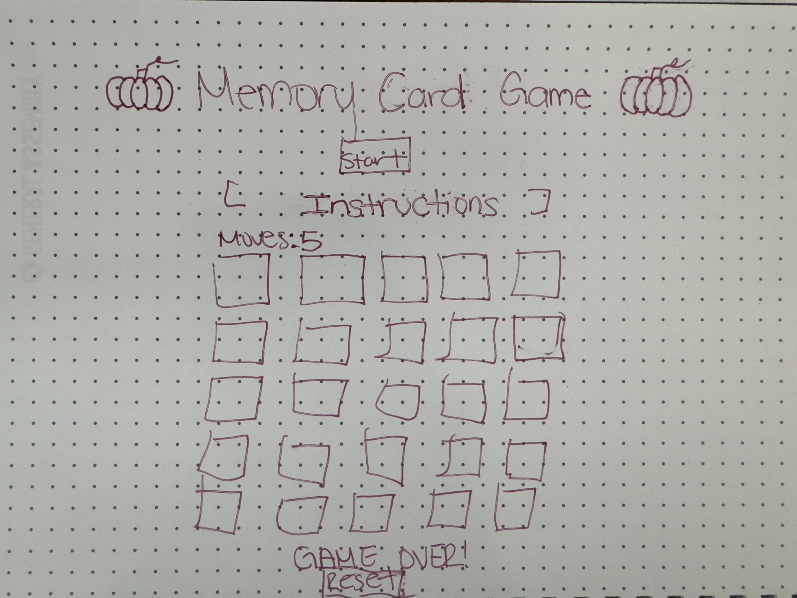

Wendy Silva
# My game proposal

## Project Choice

```Memory Card Game```

## Project Description

In this Unit 1 Project I am creating a Halloween themed Memory Card Game. I will be using the DOM manipulation technique, HTML CSS, and JavaScript. It will include a win/lose condition and be deployed online. In the game you will have a 5x4 grid of cards that will need to be matched based on how well your memory is. If you get 5 unmatched cards you lose. In the future, I would like to improve the game by adding music and levels of difficulty.

## Wire Frames



## User Story                                                         

***MVP Goals:***

- As a player, I want the game to display a grid of cards all face-down at the start.

- As a player, I want the card to flip over and reveal its image when i click on it.

- As a player, I want both cards to stay face-up when i click on another card and it matches the first one. 

- As a player, I want both cards to flip back over if they do not match.

- As a player, I want the game to track the number of wrong flips.

- As a player, I would like to be able to restart the game if I win or lose.

***Stretch Goals:***

- As a player, I would like there to be a sound effect when I flip over a card.

- As a player, I would like to have a main start window when I begin the game.

- As a player, I would like there to be levels of difficulty.


## Pseudocode

*//1) Create game variables.*

*//2) Set up initialize game function.*

*//3) Create function to flip cards.*

*//4) Create function to check for matched cards*

*//5) Create function for win/lose condition.*

*//6) Create restart function*

*//7) Call back initialize function*


## Timeline

|    Day    	|                           Task                           	|  Blockers  	| Notes/Thoughts 	|
|:---------:	|:--------------------------------------------------------:	|------------	|----------------	|
|   Friday  	| Create and present proposal                              	|            	|                	|
|  Saturday 	| Create html, css, js files, and create basic structure.  	|            	|                	|
|   Sunday  	| Begin functions                                          	|            	|                	|
|   Monday  	| Continue functions                                       	|            	|                	|
|  Tuesday  	| Add style                                                	|            	|                	|
| Wednesday 	| Finalize functions                                       	|            	|                	|
|  Thursday 	| Begin stretch goals                                      	|            	|                	|
|   Friday  	| Continue stretch goals                                   	|            	|                	|
|  Saturday 	| Overview project and launch                              	|            	|                	|
|   Sunday  	| Review                                                   	|            	|                	|
|   Monday  	| Present Project                                          	|            	|               